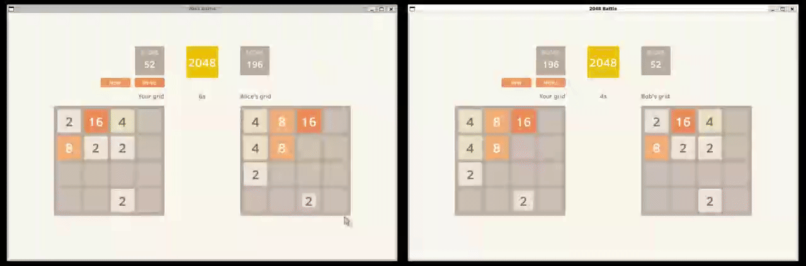

# Go 2048 Battle

[2048](https://en.wikipedia.org/wiki/2048_(video_game)) sliding puzzle game featuring singleplayer and head-to-head multiplayer modes. Built using [turdgl](https://github.com/z-riley/turdgl/).



## Dependencies

### SDL2 - DirectMedia Layer

Advanced Packaging Tool (Ubuntu):
```sh
sudo apt-get update && sudo apt-get install -y libsdl2-dev libsdl2-image-dev
```

Homebrew (MacOS):
```sh
brew install sdl2_image
```

## How to run

```sh
go run cmd/main.go
```
